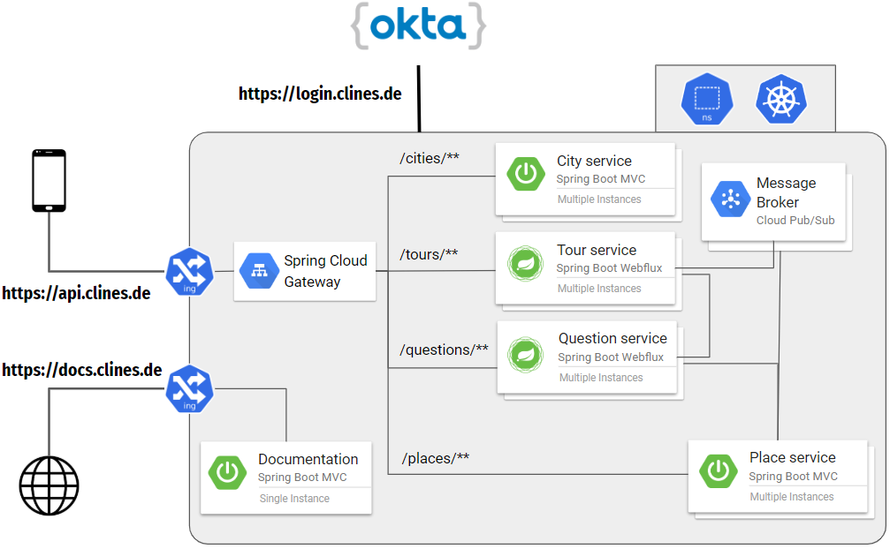

# Backend services for clines

This is a backend which I developed for a university project. It's for an app that allows you to create a city trip 
with simple yes/no questions.

I uploaded the code as a sample project for microservices with Spring Boot and Kubernetes. Suggestions for improvement 
are always welcome.

### References
Currently all services are based Spring Boot and the Spring Cloud ecosystem. You will find an overview of these on

* [Official Spring Boot Documentation](https://docs.spring.io/spring-boot/docs/current/reference/html/)
* [Official Spring Cloud Project Overview](https://spring.io/projects/spring-cloud)
* [Spring Boot Tutorials by Baeldung](https://www.baeldung.com/spring-boot)

Instead of Java, we are using Kotlin as JVM Language. Kotlin is concise and safe compared to Java as 
well as 100% interoperable with Java.

The language is very easy and quick to learn if you already have some knowledge of Java and/or Scala. You find 
tutorials and learning tools on

* [Official Kotlin Documentation](https://kotlinlang.org/docs/reference/)
* [Web-IDE for playing around with Kotlin.](https://play.kotlinlang.org/)
* [Spring Boot Tutorial with Kotlin](https://spring.io/guides/tutorials/spring-boot-kotlin/)

### Architecture



### Services
Here is a list of all services:

| Name          | Description   | Documentation |
| ------------- | ------------- | ------------- |
| [documentation](/documentation)  | Service for centralizing Swagger API Documentations. | [docs](http://localhost:8080/swagger-ui.html)
| [gateway](/gateway)  | An API-Gateway based on Spring Webflux.  | -
| [tour-service](/tour-service)  | REST-API for creating, updating and deleting tours. Also includes the recommendation algorithm for determining the next matching question based on the user's previous answers. | [docs](http://localhost:8080/swagger-ui.html#/tour-service)
| [question-service](/question-service)  | REST-API for managing and retrieving questions for the tour creation phase. | [docs](http://localhost:8080/swagger-ui.html#/question-service)
| [place-service](/place-service)  | Service for retrieving points of interests around a location. Also includes endpoints for retrieving details of a specified point of interest. | [docs](http://localhost:8080/swagger-ui.html#/place-service)
| [city-service](/city-service)  |  REST-API for querying cities around the world. | [docs](http://localhost:8080/swagger-ui.html#/city-service)

### Security
The clines backend uses the OIDC standard for authentication and authorization of users. The authorization server is 
provided by [Okta](https://www.okta.com/) and can be reached at https://login.clines.de/oauth2/default.

To authenticate against the backend services a valid access token must be passed in the Http-Header field 
"Authorization" with the prefix "Bearer". The access token can be obtained from the authorization server using various 
authentication strategies.

### Deployment

Run the application locally with

```shell script
./gradlew jibDockerBuild

docker-compose up
```

or deploy to a Kubernetes cluster with the templates in _k8s_ folders.


